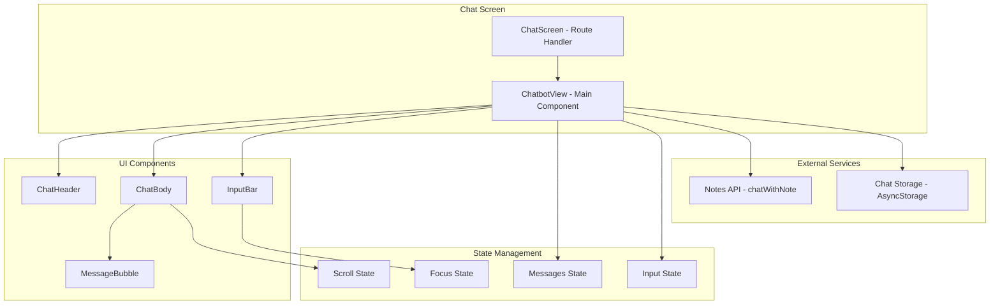

# Design Document: Chatbot Interface

## Overview

The chatbot interface is a React Native component that enables users to have AI-powered conversations about their notes. The design follows a minimal, content-first approach with a single-column vertical layout consisting of a static header, scrollable chat body, and fixed bottom input bar.

The interface integrates with the existing mobile app architecture, using the established API client for backend communication and AsyncStorage for local message persistence.

## Architecture



## Components and Interfaces

### ChatbotView (Main Component)

The root component that orchestrates the chat interface.

```typescript
interface ChatbotViewProps {
  noteId: string;
}

interface ChatMessage {
  id: string;
  text: string;
  isUser: boolean;
  timestamp: Date;
}
```

**Responsibilities:**
- Load and save chat history
- Manage message state
- Handle message sending
- Coordinate keyboard-aware layout

### ChatHeader

Static header component that remains fixed during keyboard interactions.

```typescript
interface ChatHeaderProps {
  onBackPress: () => void;
  title?: string;
}
```

**Key Implementation Notes:**
- Must be positioned outside KeyboardAvoidingView
- Uses SafeAreaView for proper inset handling
- Fixed height of 64-72px

### MessageBubble

Individual message display component with sender-specific styling.

```typescript
interface MessageBubbleProps {
  message: ChatMessage;
}
```

**Styling Logic:**
- `isUser === true`: Right-aligned, purple (#7A2EFF), white text
- `isUser === false`: Left-aligned, gray (#F2F2F2), dark text (#222222)

### InputBar

Bottom input component with send button.

```typescript
interface InputBarProps {
  value: string;
  onChangeText: (text: string) => void;
  onSend: () => void;
  placeholder?: string;
}
```

**State-Dependent Styling:**
- Border: 1px #333333 (unfocused) → 1.5px #000000 (focused)
- Send button: 50% opacity (empty) → 100% opacity (has text)

### ChatBody

Scrollable container for messages with smart scroll behavior.

```typescript
interface ChatBodyProps {
  messages: ChatMessage[];
  scrollViewRef: React.RefObject<ScrollView>;
}
```

**Scroll Behavior:**
- Auto-scroll to bottom when new message added (if already at bottom)
- Preserve scroll position when user is scrolled up

## Data Models

### ChatMessage

```typescript
interface ChatMessage {
  id: string;           // Unique identifier (UUID)
  text: string;         // Message content
  isUser: boolean;      // true = user message, false = bot message
  timestamp: Date;      // When message was created
}
```

### Storage Format

Messages are persisted to AsyncStorage with the key pattern `@chat_history_{noteId}`:

```typescript
// Serialized format (timestamps as ISO strings)
interface StoredMessage {
  id: string;
  text: string;
  isUser: boolean;
  timestamp: string; // ISO 8601 format
}
```

## Correctness Properties

*A property is a characteristic or behavior that should hold true across all valid executions of a system-essentially, a formal statement about what the system should do. Properties serve as the bridge between human-readable specifications and machine-verifiable correctness guarantees.*

### Property 1: Bot message styling consistency

*For any* message where `isUser === false`, the MessageBubble component SHALL render with left alignment (`alignSelf: 'flex-start'`), background color #F2F2F2, border radius 18-20px, and text color #222222.

**Validates: Requirements 2.1**

### Property 2: User message styling consistency

*For any* message where `isUser === true`, the MessageBubble component SHALL render with right alignment (`alignSelf: 'flex-end'`), background color #7A2EFF, border radius 20-22px, and text color #FFFFFF.

**Validates: Requirements 2.2**

### Property 3: Message chronological ordering

*For any* array of messages displayed in ChatBody, the messages SHALL be ordered by timestamp in ascending order (oldest first, newest last).

**Validates: Requirements 3.1**

### Property 4: Auto-scroll behavior based on scroll position

*For any* new message added to the chat, IF the user was at the bottom of the scroll view (within 50px threshold), THEN the view SHALL auto-scroll to show the new message; OTHERWISE the scroll position SHALL remain unchanged.

**Validates: Requirements 3.3, 3.4**

### Property 5: Input border state based on focus

*For any* focus state of the input field, the border style SHALL be: 1px solid #333333 when unfocused, 1.5px solid #000000 when focused.

**Validates: Requirements 4.2, 4.3**

### Property 6: Send button opacity based on input content

*For any* input value, the send button opacity SHALL be: 0.5 (50%) when input is empty or whitespace-only, 1.0 (100%) when input contains non-whitespace characters.

**Validates: Requirements 4.4, 4.5**

### Property 7: Send action behavior based on input content

*For any* send button tap, IF the input contains non-whitespace text THEN the message SHALL be sent and input cleared; IF the input is empty or whitespace-only THEN no action SHALL occur.

**Validates: Requirements 4.6, 4.7**

### Property 8: Message persistence round-trip

*For any* message sent in the chat, saving to storage and then loading from storage SHALL return a message with identical id, text, isUser, and timestamp values.

**Validates: Requirements 6.1, 6.2**

### Property 9: Optimistic UI update on send

*For any* user message sent, the message SHALL appear in the UI immediately (before API response), with the user message visible in the message list.

**Validates: Requirements 6.3**

### Property 10: Message accessibility labels by sender

*For any* message, the accessibility label SHALL be: "Bot says, {text}" when `isUser === false`, "You said, {text}" when `isUser === true`.

**Validates: Requirements 7.2, 7.3**

## Error Handling

### Network Errors

When the API call to `chatWithNote` fails:
1. Display an error message in the chat as a bot message
2. Allow user to retry by sending the same message again
3. Do not clear the user's input on failure

### Storage Errors

When AsyncStorage operations fail:
1. Log error to console
2. Continue operation without persistence (graceful degradation)
3. Messages remain in memory for current session

### Empty/Invalid Input

- Whitespace-only input is treated as empty
- Send button is disabled (visually via opacity)
- Tapping disabled send button has no effect

## Testing Strategy

### Unit Testing

Use Jest with React Native Testing Library for component testing:

- Test MessageBubble renders correct styles for user/bot messages
- Test InputBar border state changes on focus/blur
- Test send button opacity changes based on input value
- Test accessibility labels are correctly set

### Property-Based Testing

Use fast-check for property-based testing:

- **Property 1 & 2**: Generate random messages, verify styling matches sender type
- **Property 3**: Generate random message arrays, verify chronological ordering after sort
- **Property 5**: Generate random focus states, verify border style matches
- **Property 6**: Generate random input strings, verify opacity matches content state
- **Property 7**: Generate random inputs and send actions, verify behavior matches input state
- **Property 8**: Generate random messages, verify round-trip through storage
- **Property 10**: Generate random messages, verify accessibility label format

**Testing Framework:** Jest + fast-check
**Minimum Iterations:** 100 per property test

**Test Annotation Format:**
```typescript
// **Feature: chatbot-interface, Property {number}: {property_text}**
```

### Integration Testing

- Test full message send flow (user input → API call → bot response)
- Test chat history persistence across component remounts
- Test keyboard interaction behavior
