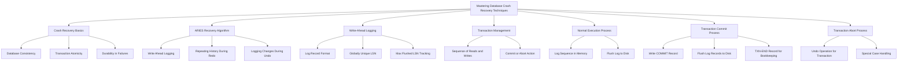

# Fixed Database Crash Recovery Mindmap

```mermaid
flowchart TD
    A[Mastering Database Crash Recovery Techniques] --> B[Crash Recovery Basics]
    A --> C[ARIES Recovery Algorithm]
    A --> D[Write-Ahead Logging]
    A --> E[Transaction Management]
    A --> F[Normal Execution Process]
    A --> G[Transaction Commit Process]
    A --> H[Transaction Abort Process]
    
    B --> B1[Database Consistency]
    B --> B2[Transaction Atomicity]
    B --> B3[Durability in Failures]
    
    C --> C1[Write Ahead Logging]
    C --> C2[Repeating History During Redo]
    C --> C3[Logging Changes During Undo]
    
    D --> D1[Log Record Format]
    D --> D2[Globally Unique LSN]
    D --> D3[Max Flushed LSN Tracking]
    
    E --> E1[Sequence of Reads and Writes]
    E --> E2[Commit or Abort Action]
    
    F --> F1[Log Sequence in Memory]
    F --> F2[Flush Log to Disk]
    
    G --> G1[Write COMMIT Record]
    G --> G2[Flush Log Records to Disk]
    G --> G3[TXN-END Record for Bookkeeping]
    
    H --> H1[Undo Operation for Transaction]
    H --> H2[Special Case Handling]
```