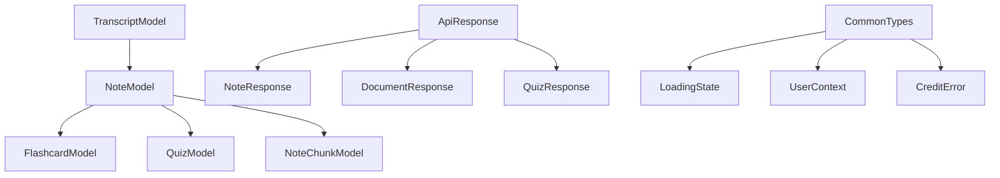

# Design Document

## Overview

The centralized types system will consolidate all TypeScript type definitions scattered throughout the application into a well-organized structure within `src/lib/types/`. This design addresses the current fragmentation where types are defined inline across hooks, services, and API routes, leading to duplication and maintenance challenges.

The system will organize types by domain/feature areas, provide clean import/export patterns, align with the existing Prisma schema, and maintain full compatibility with the current Bun-based development workflow.

## Architecture

### Directory Structure

```
src/lib/types/
├── index.ts                 # Barrel exports for commonly used types
├── common.types.ts          # Shared types used across multiple domains
├── api.types.ts            # API request/response types
├── auth.types.ts           # Authentication and user-related types
├── notes.types.ts          # Note-related types and interfaces
├── documents.types.ts      # Document and transcript types
├── quiz.types.ts           # Quiz and assessment types
├── flashcards.types.ts     # Flashcard types
├── search.types.ts         # Search and semantic search types
├── credits.types.ts        # Credit system and subscription types
├── database.types.ts       # Database model types (Prisma-aligned)
└── ui.types.ts             # UI component and interaction types
```

### Type Organization Principles

1. **Domain-Based Grouping**: Types are organized by business domain rather than technical layer
2. **Single Source of Truth**: Each type is defined once and imported where needed
3. **Prisma Alignment**: Database-related types align with Prisma schema structure
4. **API Consistency**: Request/response types follow consistent patterns
5. **Extensibility**: Structure supports easy addition of new domains

## Components and Interfaces

### Core Type Categories

#### 1. Database Types (`database.types.ts`)
Prisma-aligned types for database entities:

```typescript
// Base Prisma model types
export interface TranscriptModel {
  id: string;
  fileName: string;
  originalName: string;
  content: string;
  cleanContent: string;
  pages: number | null;
  metadata: Record<string, unknown> | null;
  userId: string | null;
  createdAt: Date;
  updatedAt: Date;
  type: string;
}

export interface NoteModel {
  id: string;
  title: string;
  content: string;
  transcriptId: string;
  userId: string | null;
  createdAt: Date;
  updatedAt: Date;
}

// Extended types with relations
export interface NoteWithTranscript extends NoteModel {
  transcript: Pick<TranscriptModel, 'id' | 'originalName' | 'createdAt'>;
}
```

#### 2. API Types (`api.types.ts`)
Standardized request/response patterns:

```typescript
// Base API response structure
export interface ApiResponse<T = unknown> {
  success: boolean;
  data?: T;
  error?: string;
  message?: string;
}

// Error response with redirection
export interface ApiErrorResponse extends ApiResponse {
  success: false;
  error: string;
  redirectToPricing?: boolean;
  redirectUrl?: string;
}

// Paginated response
export interface PaginatedResponse<T> extends ApiResponse<T[]> {
  pagination: {
    page: number;
    limit: number;
    total: number;
    hasMore: boolean;
  };
}
```

#### 3. Notes Domain (`notes.types.ts`)
All note-related types:

```typescript
export interface Note {
  id: string;
  title: string;
  content: string;
  transcriptId: string;
  userId: string | null;
  createdAt: Date;
  updatedAt: Date;
}

export interface NoteData {
  title: string;
  content: string;
  transcriptId: string;
  userId?: string;
  consumeCredits?: boolean;
}

export type NoteType = 'summary' | 'detailed' | 'action-items' | 'technical' | 'executive';

export interface ProcessPDFResult {
  transcript: {
    id: string;
    fileName: string;
    originalName: string;
  };
}
```

#### 4. Documents Domain (`documents.types.ts`)
Document and transcript types:

```typescript
export interface Document {
  id: string;
  fileName: string;
  originalName: string;
  pages: number | null;
  createdAt: Date;
  updatedAt: Date;
}

export interface DocumentWithContent extends Document {
  content: string;
  cleanContent: string;
}

export interface DocumentData {
  fileName: string;
  originalName: string;
  content: string;
  cleanContent: string;
  pages: number;
  metadata?: Record<string, unknown>;
  userId?: string;
}

export interface TranscriptData extends DocumentData {
  type?: string;
}

export interface TranscriptResponse {
  videoId: string;
  transcript_only_text: string;
  title?: string;
  duration?: number;
  [key: string]: unknown;
}
```

#### 5. Quiz Domain (`quiz.types.ts`)
Quiz and assessment types:

```typescript
export type QuestionType = 'multiple_choice' | 'true_false';

export interface QuizQuestion {
  id: number;
  type: QuestionType;
  question: string;
  options?: string[];
  correctAnswer: string;
}

export interface QuizData {
  quiz: QuizQuestion[];
}

export interface Quiz {
  id: string;
  noteId: string;
  content: QuizData;
  userId: string | null;
  createdAt: Date;
  updatedAt: Date;
}
```

#### 6. Search Domain (`search.types.ts`)
Search functionality types:

```typescript
export interface SearchChunk {
  id: number;
  chunk_text: string;
  similarity: number;
}

export interface SearchResult {
  noteId: string;
  chunks: SearchChunk[];
}

export interface UseSemanticSearchOptions {
  onError?: (error: Error) => void;
  noteId?: string;
}

export interface SemanticSearchRequest {
  query: string;
  noteId?: string;
  limit?: number;
}

export interface SemanticSearchResponse {
  results: SearchResult[];
  query: string;
  totalResults: number;
}
```

#### 7. Common Types (`common.types.ts`)
Shared utility types:

```typescript
export type LoadingState = 'idle' | 'loading' | 'success' | 'error';

export interface BaseEntity {
  id: string;
  createdAt: Date;
  updatedAt: Date;
}

export interface UserContext {
  userId: string | null;
  isAuthenticated: boolean;
}

export interface CreditError extends Error {
  redirectToPricing?: boolean;
  redirectUrl?: string;
}
```

### Import/Export Strategy

#### Barrel Exports (`index.ts`)
```typescript
// Re-export commonly used types
export type { Note, NoteData, NoteType } from './notes.types';
export type { Document, DocumentData } from './documents.types';
export type { ApiResponse, ApiErrorResponse } from './api.types';
export type { Quiz, QuizQuestion } from './quiz.types';
export type { Flashcard, FlashcardItem } from './flashcards.types';
export type { SearchResult, SemanticSearchRequest } from './search.types';
export type { LoadingState, UserContext } from './common.types';
```

#### Domain-Specific Exports
Each domain file exports all its types using named exports:
```typescript
// notes.types.ts
export interface Note { ... }
export interface NoteData { ... }
export type NoteType = ...;
```

## Data Models

### Type Alignment with Prisma Schema

The type system maintains strict alignment with the Prisma database schema:

1. **Base Model Types**: Direct representations of Prisma models
2. **Extended Types**: Models with included relations
3. **Input Types**: For create/update operations
4. **Response Types**: For API responses with computed fields

### Type Relationships



## Error Handling

### Standardized Error Types

```typescript
// api.types.ts
export interface ApiError {
  message: string;
  code?: string;
  details?: unknown;
}

export interface CreditError extends ApiError {
  redirectToPricing: boolean;
  redirectUrl?: string;
}

export interface ValidationError extends ApiError {
  field: string;
  value: unknown;
}
```

### Error Response Patterns

All API responses follow consistent error patterns:
- Standard error structure
- Credit-related error handling
- Validation error details
- Redirection information when needed

## Migration Validation

- Verify all existing type usages work with new centralized types
- Ensure no breaking changes in API contracts
- Validate Bun build process with new type structure
- Test import resolution across all modules

## Implementation Considerations

### Bun Compatibility

- All types use standard TypeScript syntax compatible with Bun
- No special build configuration required
- Maintains existing development workflow
- Supports hot reloading and type checking

### Performance Impact

- Centralized types improve TypeScript compilation performance
- Reduced duplicate type checking
- Better IDE intellisense and autocomplete
- Faster development feedback loops

### Maintenance Benefits

- Single location for type definitions
- Easier refactoring and updates
- Consistent naming conventions
- Better documentation and discoverability